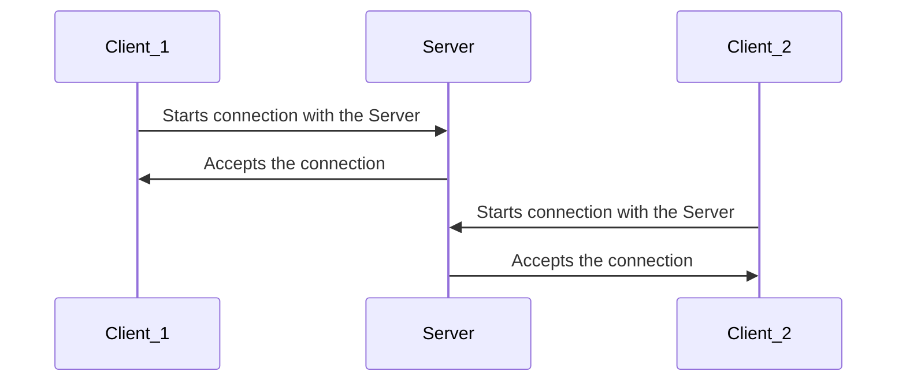
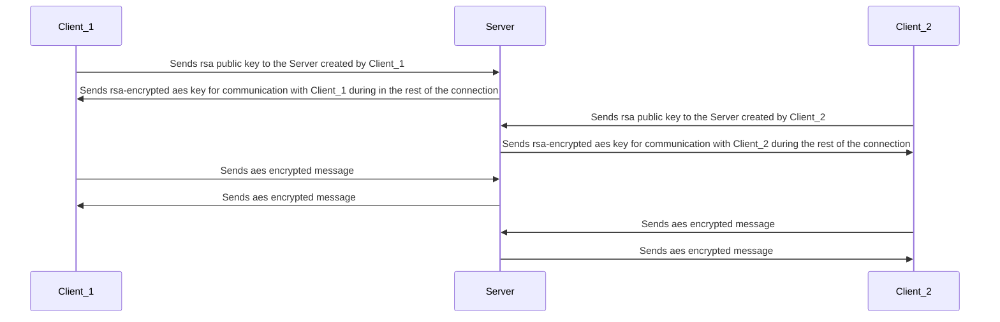
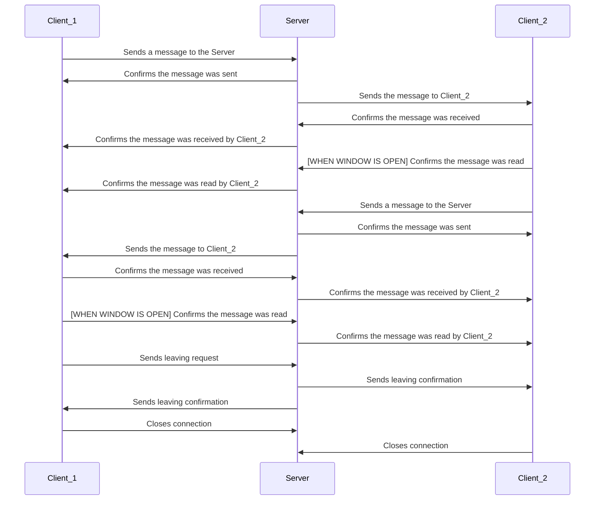

# Bla Bla Bla Protocol

The Bla Bla Bla Chat is built over the Bla Bla Bla Protocol, an application-level protocol for simple, encrypted peer-to-peer message exchanging.
The protocol is based in the client-server architecture, with the server centralizing both clients and their messages.

## Connection
Before exchanging messages, both users must connect with the server. The process of establishing a connection is described in the diagram below:


## Encryption setup
After the socket connection is established, the encryption keys should be setup before message exchanging. The encryption used in the protocol is aes. The aes key must be passed from the server to the clients though, and each client has their own unique key. For exchanging aes keys, rsa asymmetric encryption is used. The process for trading keys is describedi in the following diagram:


## Message exchanging
After establishing connection and setting up the encryption keys, the chat is ready to start the conversation between both users. The behavior of the protocol during the message exchanging is described in the diagram below, and it was optimized to be able to keep the user updated in the situation of the message, including a reading confirmation.


# Bla Bla Bla Chat
A cross-platform chat application designed over the Bla Bla Bla Protocol to run on a local network using sockets, following a client-server architecture.

## User Instructions
To use this application as an end user, no setup is required. Simply run the provided executables in "dist" folder. Choose the folder with the operational system you use and run the executable. No errors should arise during this process.

## Development Setup
To set up the development environment, follow the steps below.

1. Create a Virtual Environment
Ensure you are in the root directory of the project and that a requirements.txt file is present. Python must be installed. Then, create a virtual environment named .venv:

```bash
python -m venv .venv
```

2. Activate the Virtual Environment
Activate the environment according to your operating system:

#### On Windows (Command Prompt):
```cmd
.venv\Scripts\activate
```

#### On Windows (PowerShell):
```powershell
.\.venv\Scripts\Activate.ps1
```

#### On macOS/Linux:
```bash
source .venv/bin/activate
```

3. Install Project Dependencies
With the virtual environment activated, install all required dependencies using:

```bash
pip install -r requirements.txt
```

In case any error arises, try updating pip. If the error persists, try removing the versions from requirements.txt, leaving only the name of the dependencies, but be aware that version compatibility issues might arise. 

### Starting the application
In order to start the application locally for testing purposes, execute start_on_windows.bat (for Windows users) or start_on_linux.sh (for Linux users). Those scripts will open three terminal windows: one for the server to control the chat and two clients to interact with it. Errors in execution might arise mostly in linux because requirements work differently in linux.