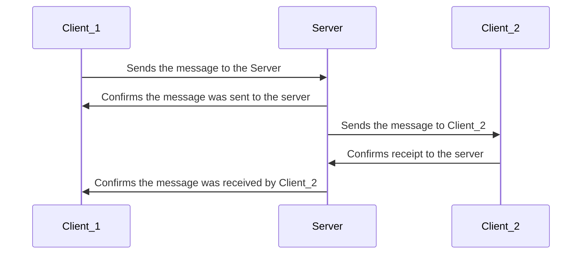

# Bla Bla Bla Protocol
A



# Bla Bla Bla Chat
A cross-platform chat application designed to run on a local network using sockets, following a client-server architecture.

## Development Setup
To set up the development environment, follow the steps below.

1. Create a Virtual Environment
Ensure you are in the root directory of the project and that a requirements.txt file is present. Python must be installed. Then, create a virtual environment named .venv:

```bash
python -m venv .venv
```

2. Activate the Virtual Environment
Activate the environment according to your operating system:

#### On Windows (Command Prompt):
```cmd
.venv\Scripts\activate
```

#### On Windows (PowerShell):
```powershell
.\.venv\Scripts\Activate.ps1
```

#### On macOS/Linux:
```bash
source .venv/bin/activate
```

3. Install Project Dependencies
With the virtual environment activated, install all required dependencies using:

```bash
pip install -r requirements.txt
```

### Starting the application
In order to start the application locally for testing purposes, execute start_on_windows.bat (for Windows users) or start_on_linux.sh (for Linux users). Those scripts will open three terminal windows: one for the server to control the chat and two clients to interact with it.   

## User Instructions
To use this application as an end user, no development setup is required, though Python programming language should be installed. Simply run the provided executables or follow the usage instructions in the appropriate section. This portion of the documentation will be expanded with step-by-step guide.

### Starting the application
For the application to work, you must have [NO FIM VAMOS TER QUE MANDAR O USUÁRIO INSTALAR TUDO OU ENTÃO GERAMOS EXECUTÁVEIS]


su
type your passwod
apt-install python3.10-venv 


pip list should show something like 
```
logger     1.4
pip        22.3
PyQt5      5.15.11
PyQt5-Qt5  5.15.2
PyQt5_sip  12.17.0
setuptools 65.5.0
```